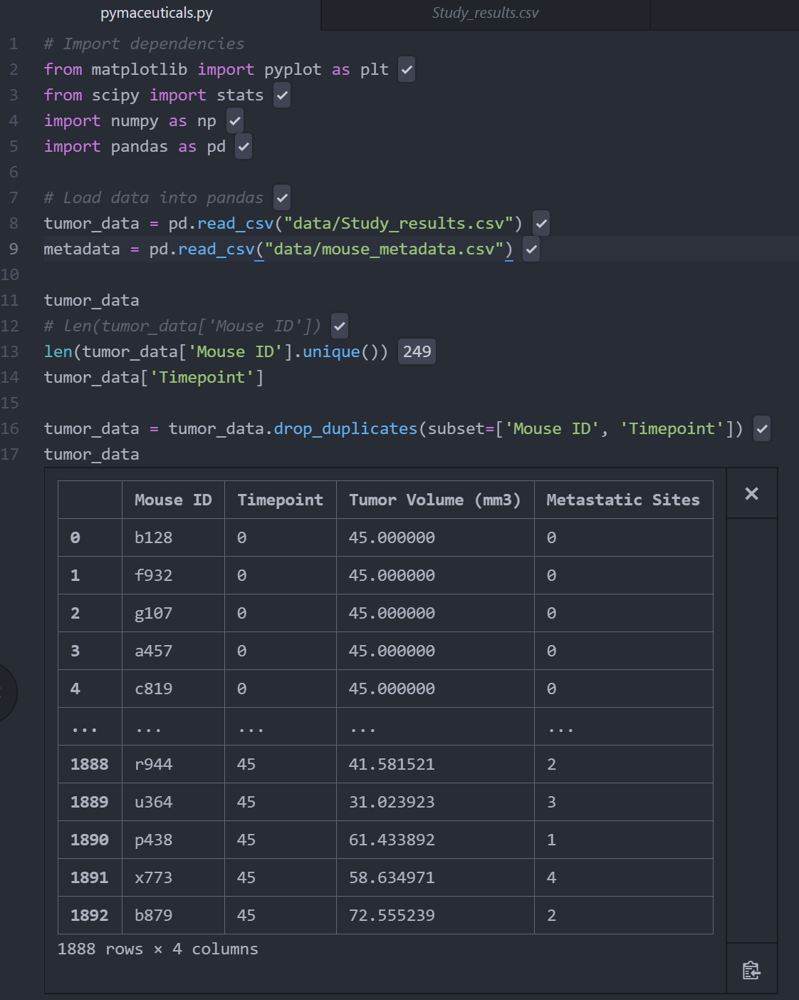
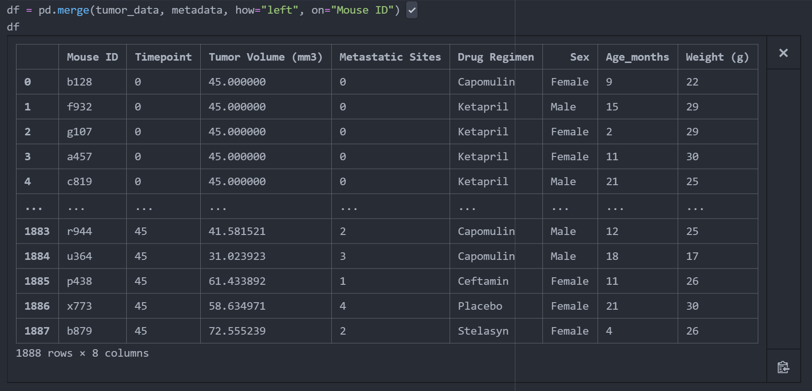
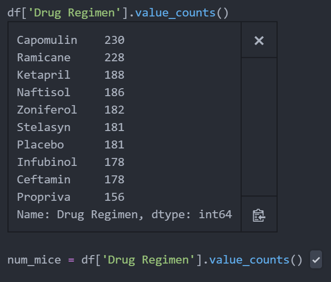
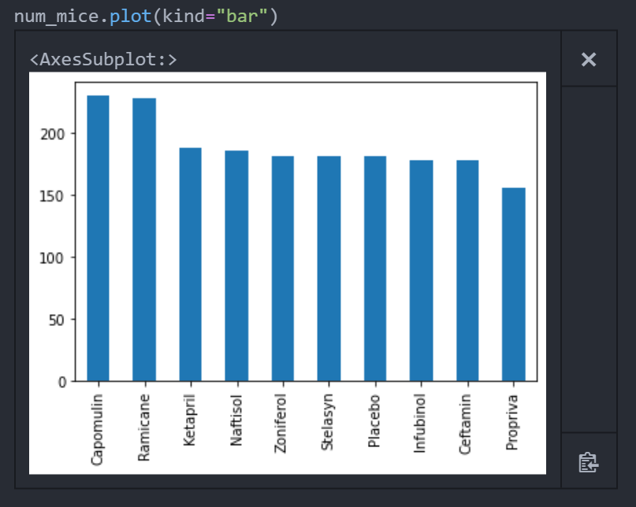

# Matplotlib

**Background**

Project story:

**Project Scope**

Project plan and tasks:

Load datasets 

Merge datasets 

Count of mice by drug regimen  

Histogram 

**Analysis**

Project statistics.
<!-- 
|Table|Col1|Col2|
|----|----|----|
|1|2|3|4| -->

**Findings**

Project insights from data and process.

**Conclusion**

Futher action, data exploration and limitations.
