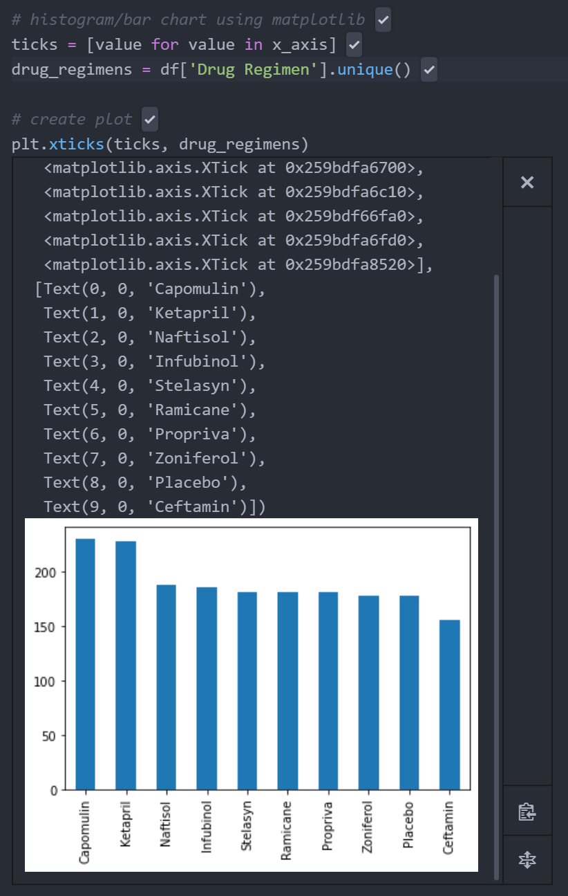

# Matplotlib

**Background**

Project story:

**Project Scope**

Project plan and tasks:

Load datasets:
- Read the data files into pandas:

        read_csv('data/Study_results.csv')
        read_csv('data/mouse_metadata.csv')
- Count of nonduplicate Mouse Ids:

        len(tumor_data['Mouse ID'].unique())
- Drops duplicates where both columns are identical 
    
        tumor_data = drop_duplicates(subset= ['Mouse ID', 'Timepoint'])

    

Merge the two datasets and save as a new dataframe:
- Adds the metadata for each Mouse ID to the tumor volume study data.

        df = pd.merge(tumor_data, metadata, how="left", on="Mouse Id")

    

Count mice by drug regimen:

        num_mice = df['Drug Regimen'].value_counts()

 

Histogram using pandas

        num_mice.plot(kind="bar")

Histogram using matplotlib

        x_axis = np.arange(len(num_mice))
        drug_regimens = df['Drug Regimen'].unique()
        ticks = [value for value in x_axis]
        plt.xticks(ticks, drug_regimens)

**Analysis**

Summary statistics.

        mean = df.groupby('Drug Regimen').mean()['Tumor Volume (mm3)']
        median = df.groupby('Drug Regimen').mean()['Tumor Volume (mm3)']
        variance = df.groupby('Drug Regimen').median()['Tumor Volume (mm3)']
        std_dev = df.groupby('Drug Regimen').var()['Tumor Volume (mm3)']
        sem = df.groupby('Drug Regimen').sem()['Tumor Volume (mm3)']
        table = pd.DataFrame(
            {'mean': mean, 'median': median, 'variance': variance, 'std_dev': std_dev, 'sem': sem})

<!-- 
|Table|Col1|Col2|
|----|----|----|
|1|2|3|4| -->

**Findings**

Project insights from data and process.

**Conclusion**

Futher action, data exploration and limitations.
